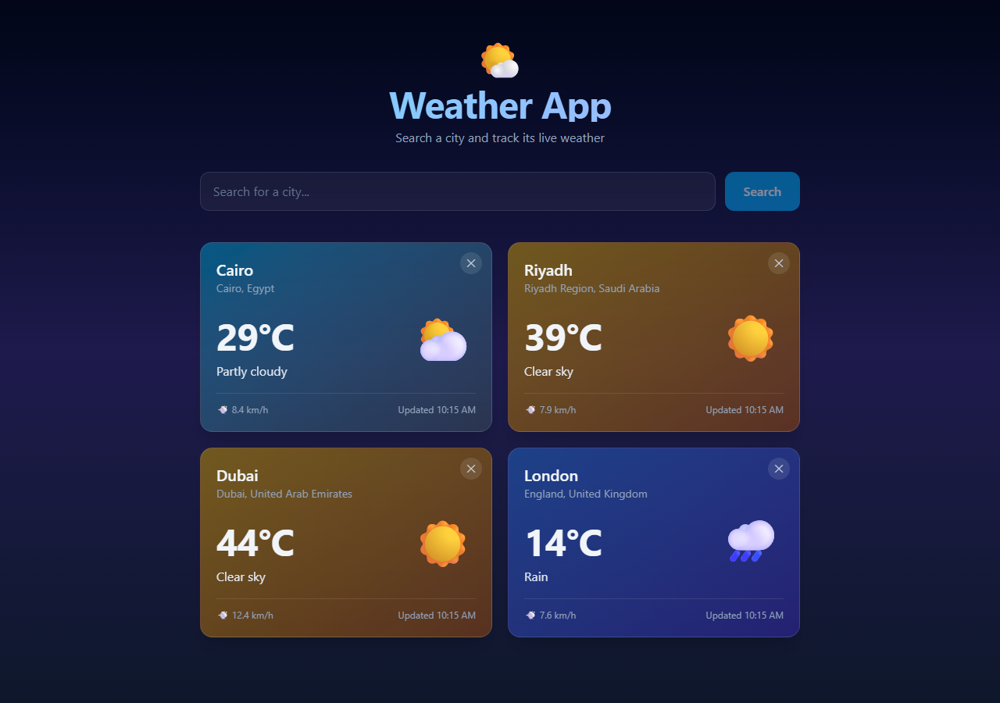

# 🌤️ Weather App

A responsive weather app that lets you search for any city in the world and track its live weather in one dashboard.

**🔗 Live demo:** [weather-app-gamma-lemon.vercel.app](https://weather-app-gamma-lemon.vercel.app/)



## Features

- 🔍 City search with debouncing (waits 500 ms after typing before calling the API)
- 🌡️ Live temperature, wind speed and weather condition with matching icons
- 🌗 Day/night aware icons and card colors that change with the weather
- 🔄 Auto-refresh of every saved city every 60 seconds
- 💾 Saved cities persist across visits using `localStorage`
- ⏳ Loading skeletons, empty states and error messages
- 📱 Fully responsive layout (mobile → desktop)
- ♿ Keyboard-accessible buttons and ARIA labels

## Tech Stack

- [React 19](https://react.dev/) + [TypeScript](https://www.typescriptlang.org/)
- [Vite](https://vite.dev/)
- [Tailwind CSS 4](https://tailwindcss.com/)
- [Open-Meteo API](https://open-meteo.com/) (geocoding + forecast, no API key needed)

## Getting Started

```bash
# install dependencies
npm install

# start the dev server
npm run dev

# type-check and build for production
npm run build

# preview the production build
npm run preview
```

## Project Structure

```
src/
├── components/
│   ├── Header.tsx           # App title
│   ├── SearchResultItem.tsx # One row in the search results
│   └── SingleCity.tsx       # Weather card for a saved city
├── hooks/
│   ├── useFetch.ts          # Generic fetch hook (loading, error, abort)
│   └── useLocalStorage.ts   # State synced with localStorage
├── weather.ts               # Maps weather codes to icons, labels, colors
├── Types.ts                 # Shared TypeScript types
└── App.tsx                  # Search + saved cities
```

## What I Learned

- Building reusable custom hooks (`useFetch`, `useLocalStorage`)
- Debouncing user input and cancelling in-flight requests with `AbortController`
- Typing API responses and component props with TypeScript
- Styling a responsive UI with Tailwind CSS

## Credits

Weather data by [Open-Meteo](https://open-meteo.com/) (CC BY 4.0).
